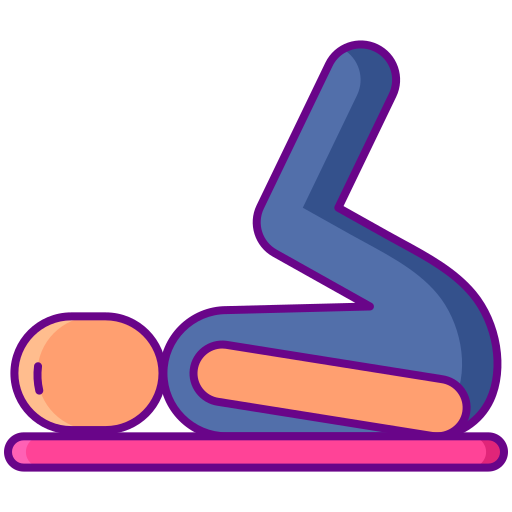

# 🏋️ Assistente Personal Trainer Inteligente

    

## 🎯 Sobre o Projeto

Este projeto é um assistente de personal trainer detalhista e automatizado, focado em criar planos de treino personalizados com base nas preferências e necessidades do usuário. Utiliza engenharia de *prompts* para garantir motivação e progressão constante.

---

## 📋 Índice

- [Introdução](#introdução)  
- [Informações do Usuário](#informações-do-usuário)  
- [Plano de Treino Ideal](#plano-de-treino-ideal)  
- [Sugestões de Adaptação](#sugestões-de-adaptação)  
- [Materiais de Apoio](#materiais-de-apoio)

---

## 📝 Introdução

O assistente usa as seguintes informações fornecidas pelo usuário para gerar o plano:

- **Biotipo Corporal**: Ectomorfo, mesomorfo, endomorfo  
- **Disponibilidade de Tempo**: 30 min/dia, 1 hora/dia, 3x por semana  
- **Objetivo**: Emagrecimento, hipertrofia, resistência  
- **Preferências de Exercício**: Musculação, funcional, yoga, HIIT, cardio  
- **Local de Treino**: Academia, casa, ar livre  
- **Nível Atual**: Iniciante, intermediário, avançado

---

## 🏋️ Plano de Treino Ideal

1. **Frequência Semanal**: Sugestão baseada na rotina do usuário.  
2. **Divisão dos Treinos**: Exemplo: ABC (3 dias) ou Full Body (1 dia).  
3. **Tempo Total**:
   - Aquecimento: 5-10 min  
   - Treino principal: 30-45 min  
   - Alongamento: 5-10 min  
4. **Equipamentos**: Pesos livres, elásticos, ou sem equipamentos, dependendo do local.  
5. **Adaptação**: Treinos rápidos para dias curtos ou exercícios de baixo impacto para limitações físicas.

---

## 🛠️ Sugestões de Adaptação

- **Pouco Tempo?** Aposte em treinos de alta intensidade (HIIT).  
- **Treinando em Casa?** Use o peso do corpo ou objetos improvisados.  
- **Progressão Semanal**: Aumente levemente a carga ou o tempo de treino para evitar estagnação.

---

## 📖 Materiais de Apoio

- [Guia para Engenharia de Prompts](https://textcortex.com/pt/post/prompt-engineering-guide)  
- [Práticas com Assistentes Virtuais](https://fvivas.com/assistentes-virtuais-explicados)

---

## Prompt de Resposta Proposto

Este plano oferece uma abordagem prática e motivadora, com instruções claras sobre evolução e formas de medir resultados, garantindo aderência ao longo do tempo.
